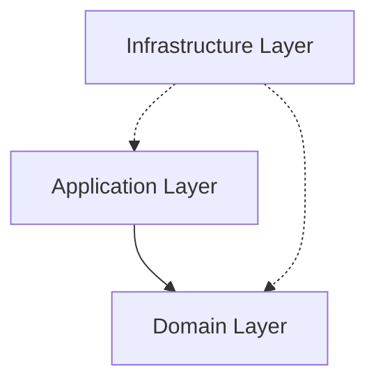
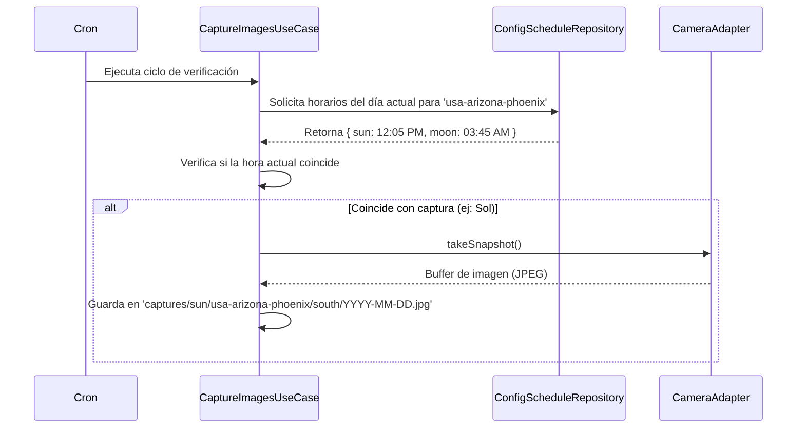

# Analemma

Un sistema de captura automatizado y un visor web moderno para la generación de analemas solares y lunares mediante cámaras de vigilancia.

El proyecto está diseñado bajo los principios de **Arquitectura Clean y Domain-Driven Design (DDD)**. Consta de dos partes principales:
1. Una aplicación Node.js que orquesta las capturas basada en coordenadas astronómicas dinámicas.
2. Un visualizador web SSR/SSG desarrollado en **Astro**.

---

## 🏗️ Arquitectura del Sistema (DDD)

El motor principal (`src/`) se organiza en capas estrictas para mantener el dominio aislado de la infraestructura:

| Capa | Descripción | Contenido |
| --- | --- | --- |
| **Domain** | Reglas de negocio puras | Entidades (`Location`, `Camera`), Value Objects, interfaces de repositorios (`CameraRepository`). |
| **Application** | Casos de uso | Lógica de orquestación como `CaptureImagesUseCase`, interactuando con repositorios inyectados. |
| **Infrastructure** | Implementaciones concretas | Adaptadores para API RTSP/HTTP de cámaras de vigilancia (`DahuaCameraAdapter`, `HikvisionCameraAdapter`), cálculo de efemérides (`ConfigScheduleRepository` usando `suncalc`). |

---

## 🚀 Cómo Funciona la Orquestación

El sistema calcula los horarios precisos de captura cada día para cada ubicación.

---

## ⚙️ Configuración (Environment & Localizaciones)

Las cámaras y horarios se definen en `src/config/locations.ts`. El sistema calcula dinámicamente las horas basado en coordenadas.

### Variables de Entorno `.env`

| Variable | Uso |
| --- | --- |
| `NODE_ENV` | `development` o `production` |
| `CRON_SCHEDULE` | Expresión cron (ej. `*/1 * * * *` para cada minuto) |
| `OUTPUT_DIR` | Directorio raíz para guardar las imágenes (ej. `./captures`) |

*Nota: Requiere establecer la zona horaria del sistema a `America/La_Paz` para cálculos predecibles si el servidor difiere de la ubicación.*

---

## 📸 Visor Web (Astro)

El directorio `web/` contiene una aplicación en **Astro** y **Tailwind CSS v4** para visualizar y reproducir los timelapses.
Lee el [`web/README.md`](./web/README.md) para más detalles.

---

## 🛠️ Scripts Disponibles

Ejecutar desde la raíz del proyecto:

- `npm run dev`: Inicia el orquestador en modo desarrollo (nodemon).
- `npm run start`: Inicia el proceso en producción.
- `npm run test:unit`: Ejecuta los tests unitarios (`node:test`).
- `npm run lint` / `npm run format`: Chequeos Biome.