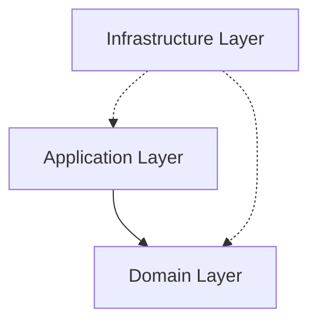
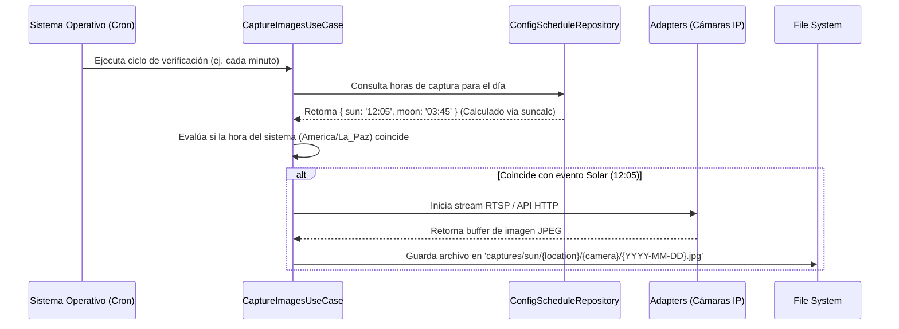

# Analemma

Bienvenidos al repositorio de **Analemma**, un sistema completo para la captura fotográfica automatizada y visualización interactiva de analemas solares y lunares.

Este proyecto ha sido concebido para funcionar de manera ininterrumpida, coordinando cámaras IP (RTSP/HTTP) repartidas globalmente, y cuenta además con un **Visualizador Web Moderno** (SSG/SSR) construido en Astro para consumir los miles de fotogramas generados sin necesidad de bases de datos tradicionales.

---

## 🏛️ Arquitectura del Software (Domain-Driven Design)

Para mantener el código mantenible, escalable y testable, el núcleo del orquestador fotográfico (`src/`) ha sido estructurado siguiendo estrictamente los preceptos de **Clean Architecture** y **Domain-Driven Design (DDD)**.

### 1. Domain Layer (`src/domain/`)
Es el corazón del software. Aquí residen las reglas de negocio puras, sin dependencias externas:
- **Entidades (`Location`, `Camera`)**: Un `Location` encapsula datos geográficos (país, estado, ciudad) y genera slugs dinámicos como `usa-arizona-phoenix`. Una `Camera` pertenece a un `Location` y mantiene su orientación cardinal (ej: `north`, `south`).
- **Value Objects**: Manejamos objetos como `CelestialObject` (`sun`, `moon`) que estandarizan el vocabulario de dominio.
- **Contratos (Interfaces)**: Definimos cómo el dominio espera interactuar con el mundo exterior mediante interfaces como `CameraRepository` y `ScheduleRepository`, usando la convención de no anteponer la letra "I" en TypeScript.

### 2. Application Layer (`src/application/`)
Contiene los casos de uso principales. Actúa como el orquestador entre el Dominio y la Infraestructura.
- **`CaptureImagesUseCase`**: Su labor es inquirir las horas de captura programadas para el día de hoy, iterar sobre las ubicaciones y, si la hora actual coincide con la hora astronómica esperada, solicitar a los repositorios de cámara inyectados que tomen una foto (`takeSnapshot()`), manejando su almacenamiento en disco.

### 3. Infrastructure Layer (`src/infrastructure/`)
Donde el código interactúa con el mundo físico:
- **Adaptadores de Cámara**: Implementaciones para diferentes fabricantes (`DahuaCameraAdapter`, `HikvisionCameraAdapter`).
- **`ConfigScheduleRepository`**: Un repositorio dinámico que usa librerías astronómicas como `suncalc` para calcular efemérides (horas precisas del paso solar/lunar por el meridiano) usando las coordenadas de cada `Location` registradas en `src/config/locations.ts`, reemplazando por completo los viejos archivos JSON estáticos.

---

## 🚀 Ciclo de Orquestación (Cron)

El orquestador está diseñado para ejecutarse cíclicamente y atrapar el milisegundo preciso.

---

## ⚙️ Configuración y Variables de Entorno (`.env`)

El sistema es altamente parametrizable. Asegúrate de configurar la zona horaria de tu servidor en `America/La_Paz` (UTC-4), ya que la aplicación utiliza este ancla para sincronizar y comparar los horarios globales.

| Variable | Descripción |
| :--- | :--- |
| `NODE_ENV` | Define el entorno (`development`, `production`, `test`). |
| `CRON_SCHEDULE` | Expresión Cron estándar. Recomendado `*/1 * * * *` para evaluación minuto a minuto. |
| `OUTPUT_DIR` | Ruta raíz del File System donde se almacenarán jerárquicamente las capturas (ej. `./captures`). |

---

## 📸 Visor Web (PWA / SSR)

Dentro del directorio `web/`, encontrarás el **Analemma Web Viewer**. Es una Progressive Web App construida con Astro, diseñada para indexar el directorio de imágenes y reproducirlas como timelapses dinámicos en un UI elegante y personalizable.

Para detalles exhaustivos sobre la arquitectura frontend (manejo de memoria en buffers de imágenes, SEO, y ViewTransitions), por favor consulta el [`web/README.md`](./web/README.md).

---

## 🛠️ Guía Rápida de Scripts

Ejecuta estos comandos desde la raíz del proyecto para tareas de desarrollo o despliegue:

- `npm run dev`: Levanta el orquestador principal en modo desarrollo (nodemon activo).
- `npm run start`: Inicia el orquestador para producción.
- `npm run test:unit`: Dispara la suite de pruebas unitarias (`node:test` nativo).
- `npm run lint` / `npm run format`: Ejecuta comprobaciones estrictas de sintaxis y formateo de código mediante Biome.