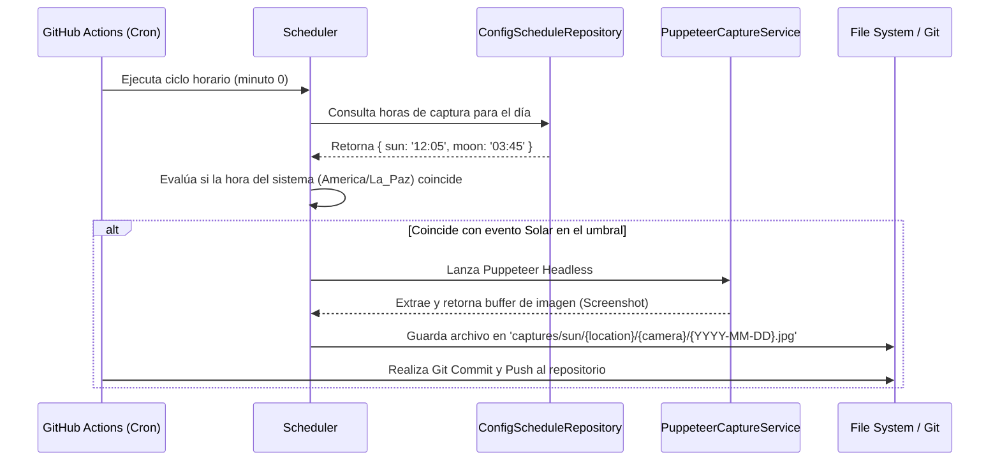

# Analemma

Un sistema completo para la captura fotográfica automatizada y visualización interactiva de analemas solares y lunares.

Este proyecto automatiza la captura periódica de imágenes provenientes de webcams públicas, generando secuencias (timelapses) que evidencian el movimiento aparente del Sol y la Luna a lo largo del tiempo. Las imágenes son capturadas en momentos astronómicos precisos mediante GitHub Actions y consumidas luego en un Visualizador Web Moderno (PWA) de alto rendimiento. Todo el sistema funciona sin requerir bases de datos tradicionales, basándose en el propio sistema de archivos de un repositorio Git.

---

## Arquitectura del Software

Para mantener el código mantenible, escalable y testable, el núcleo del orquestador fotográfico (`src/`) ha sido estructurado siguiendo estrictamente los preceptos de **Clean Architecture** y **Domain-Driven Design (DDD)**.

### 1. Domain Layer

Es el corazón del software. Aquí residen las reglas de negocio puras, independientes de cualquier framework o infraestructura externa:

- **Entidades (`Location`, `Camera`)**: Un `Location` encapsula datos geográficos (país, estado, ciudad) y genera identificadores dinámicos. Una `Camera` está vinculada a un `Location` y mantiene su orientación cardinal.
- **Value Objects**: Objetos como `CelestialObject` estandarizan el vocabulario de dominio.
- **Contratos (Interfaces)**: Abstracciones como `ScheduleRepository` que definen cómo el dominio espera obtener o persistir datos.

### 2. Application Layer

Contiene los casos de uso principales. Actúa como el orquestador que coordina el Dominio y la Infraestructura para cumplir con los requerimientos del sistema.

- **`Scheduler`**: Es el encargado de revisar los horarios programados de cada `Location`. Si la hora actual de ejecución coincide (o se encuentra en el umbral) de una captura programada, coordina al servicio de captura correspondiente para obtener la imagen.

### 3. Infrastructure Layer

Donde el código interactúa con servicios externos, I/O, y frameworks:

- **Servicios de Captura**: Se utiliza Puppeteer (`PuppeteerCaptureService`) para visitar páginas web de webcams públicas, esperar la carga de componentes multimedia y extraer limpiamente los fotogramas (screenshots) del flujo de video o canvas sin incluir la interfaz web.
- **`ConfigScheduleRepository`**: Un repositorio dinámico que usa configuraciones para calcular horarios precisos de captura en las coordenadas de cada `Location` registradas en `src/config/locations.ts`.

---

## Ciclo de Orquestación

El orquestador está diseñado para ejecutarse cíclicamente a través de GitHub Actions, optimizando recursos mediante un cronjob.

---

## Configuración y Variables de Entorno

El sistema se basa en configuraciones centralizadas, requiriendo muy poco para ejecutarse. Lo principal es la sincronización temporal.

| Variable | Descripción |
| :--- | :--- |
| `TZ` | **Crítico:** Asegura la configuración de la zona horaria en `America/La_Paz` (UTC-4). La aplicación utiliza este ancla para sincronizar y comparar los horarios astronómicos esperados con el cronjob horario. |

---

## Visor Web (PWA / SSR)

Dentro del directorio `web/`, encontrarás el Analemma Web Viewer. Es una Progressive Web App, diseñada para indexar el directorio estático de imágenes capturadas (`captures/`) y reproducirlas como timelapses dinámicos fluidos mediante una interfaz web.

---

## Guía Rápida de Scripts

Ejecuta estos comandos desde la raíz del proyecto para tareas de desarrollo o despliegue:

- `npm run start`: Inicia el orquestador para evaluar horarios de captura y ejecutar.
- `npm run test:unit`: Dispara la suite de pruebas unitarias (`node:test` nativo).
- `npm run lint` / `npm run format`: Ejecuta comprobaciones estrictas de sintaxis y formateo de código mediante Biome.
