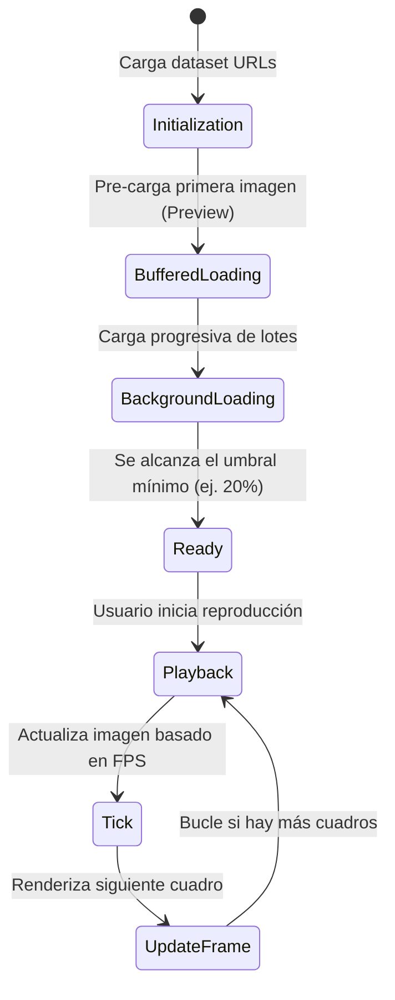
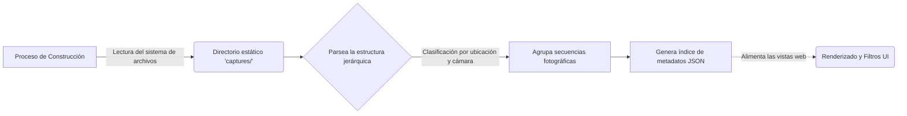

# Analemma Web Viewer

Esta es una aplicación web interactiva diseñada específicamente para visualizar fluidamente decenas de miles de capturas fotográficas (timelapses) generadas por el orquestador principal del proyecto, evidenciando los trayectos del Sol y la Luna a lo largo de extensos períodos de tiempo.

---

## Arquitectura UI y Experiencia de Usuario (UX)

La aplicación web ha sido concebida para brindar un rendimiento superior, especialmente al manipular un gran volumen de imágenes a alta resolución sin comprometer la memoria o fluidez del navegador.

### Transiciones Fluidas

Se implementa una navegación que intercepta los clics del usuario y carga dinámicamente la siguiente página en el DOM sin recargar la pantalla completa. Esto asegura que el estado de la interfaz, como el tema visual o la navegación principal, se mantenga ininterrumpido.

### Persistencia del Modo Oscuro

El esquema de color oscuro/claro es detectado desde el sistema y mantenido consistentemente a lo largo de las sesiones del usuario. Gracias a la sincronización con las transiciones de página, no existen parpadeos visuales ("flickering") al navegar entre diferentes vistas.

---

## El Corazón del Visor: El Reproductor

Un reto crítico al visualizar miles de imágenes (ej. un Analema anual tiene 365 cuadros de alta resolución) es el colapso de la memoria del dispositivo del usuario final. Para mitigarlo, el reproductor de imágenes se apoya en una arquitectura liviana y optimizada:

### 1. Carga Bufferizada Asíncrona (Buffered Loading)

En lugar de forzar al navegador a descargar todas las imágenes antes de permitir la interacción, el reproductor inicia un proceso en segundo plano que descarga las imágenes en pequeños lotes asíncronos. La reproducción se habilita una vez que un porcentaje mínimo de cuadros ya está disponible localmente, previniendo bloqueos visuales.

### 2. Control Dinámico de Velocidad

El usuario tiene control total sobre la velocidad de reproducción, que puede ser ajustada en tiempo real. El reproductor recalcula instantáneamente los intervalos de transición entre cuadros (FPS) sin interrupciones.

---

## Indexación sin Bases de Datos Relacionales

Todo el sistema está diseñado para prescindir de infraestructuras complejas como bases de datos SQL o NoSQL.

En su lugar, el visor web indexa directamente la estructura de carpetas estáticas donde residen las imágenes (`captures/`) durante el proceso de compilación:

Este índice ligero es consumido por la interfaz web, permitiendo aplicar filtros rápidos y precisos en el lado del cliente sin requerir peticiones de red adicionales ni latencia.

---

## Listo para Dispositivos Móviles y Offline

El visor web incorpora características avanzadas para maximizar su alcance:

- **Metadatos Optimizados** para asegurar que los enlaces compartidos en redes sociales incluyan imágenes y descripciones representativas.
- Configurado como **Aplicación Web Progresiva (PWA)**, permitiendo su instalación directa en dispositivos.
- **Modo Offline Básico**, implementando políticas de caché mediante un Service Worker para ofrecer una experiencia continua incluso con redes inestables.
- **Tipografías Auto-alojadas**, evitando tiempos de carga adicionales o dependencias de servidores externos.

---

## Comandos Disponibles

Ejecuta estos comandos desde el directorio `web/` para tareas de desarrollo:

- `npm run dev`: Inicia el entorno de desarrollo local, incluyendo la indexación de imágenes.
- `npm run build`: Genera la versión optimizada de producción.
- `npm run preview`: Levanta un servidor estático para previsualizar el resultado de producción.
- `npm run check` / `npm run format`: Ejecuta análisis y formateo de código para asegurar estándares de calidad.