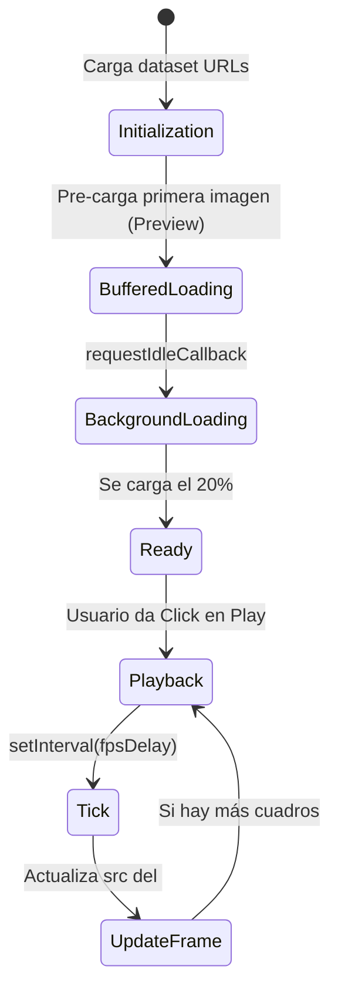

# 🌌 Analemma Web Viewer

Bienvenido al repositorio frontend del proyecto **Analemma**. Esta es una **Progressive Web App (PWA)** renderizada en el servidor (SSR) mediante **Astro 6** y embellecida con **Tailwind CSS v4**, concebida específicamente para visualizar fluida e interactivamente decenas de miles de capturas fotográficas (timelapses) generadas por el orquestador principal del proyecto.

---

## 🏗️ Arquitectura UI y Experiencia de Usuario (UX)

La web no es un sitio común; ha sido diseñada con técnicas avanzadas de frontend para minimizar cuellos de botella al manipular un gran volumen de imágenes.

### Transiciones Fluidas (SPA-Like)
Hemos implementado Astro `<ViewTransitions />`. Esto intercepta los clicks del usuario y pre-fetchea la siguiente página (`/view/[id].astro`), inyectándola dinámicamente en el DOM sin recargar la pantalla completa. Esto permite que el estado del layout (Navbar, Footer, Tema) se mantenga constante.

### Persistencia del Modo Oscuro
El esquema de color `dark/light` es detectado desde el Sistema Operativo y persistido en `localStorage`. Gracias a un listener de `astro:after-swap`, la clase `.dark` en el `<html>` nunca sufre de "flickering" durante la navegación SPA, entregando una experiencia visual impecable.

---

## 🎬 El Corazón del Visor: `Player.astro`

Un reto crítico al visualizar miles de imágenes (ej. un Analema anual tiene 365 cuadros) es el colapso de la memoria del navegador. Para mitigarlo, `Player.astro` contiene una clase escrita en **Vanilla JS** pura (sin frameworks de JS reactivos que sobrecarguen el DOM) para optimizar el rendimiento:



### 1. Carga Bufferizada Asíncrona (Buffered Loading)
En lugar de forzar al DOM a procesar todas las imágenes en el HMTL inicial o esperar a que todas carguen para permitir el play, el player usa `requestIdleCallback` para descargar batches de 5 imágenes (`new Image()`) en background sin bloquear el hilo principal (Main Thread), y habilita la reproducción de manera inmediata usando la imagen de *preview* como "place-holder".

### 2. Control de Velocidad (FPS)
El reproductor limpia y re-inicializa los `setInterval()` al vuelo cuando el usuario cambia la velocidad en el `<select>`, modificando dinámicamente el *delay* entre 33ms (30x) y 1000ms (1x).

---

## 🗄️ Generación Estática sin Base de Datos (Manifest Indexing)

El motor principal almacena imágenes puras en el servidor bajo la ruta `/captures/`. ¿Cómo sabe Astro qué páginas compilar y qué filtros aplicar si no hay una base de datos relacional SQL/NoSQL conectada?

Astro utiliza un script nativo en Node.js de pre-build. Antes de arrancar el servidor de desarrollo o compilar para producción, corre `scripts/generate-manifest.js`:

```mermaid
graph LR
    A[Node.js (generate-manifest.js)] -->|Lee fs.readdirSync recursivo| B(Directorio estático '../captures/')
    B --> C{Parsea la estructura de carpetas}
    C -->|sun/usa-arizona-phoenix/north/YYYY-MM-DD.jpg| D[Agrupa por ID: 'sun-usa-arizona-phoenix-north']
    D --> E[Crea 'src/data/manifest.json']
    E -.->|import manifest| F(Astro SSG/SSR: getStaticPaths)
```

Este `manifest.json` alimenta las tarjetas (Cards) en `index.astro`, donde filtros rápidos escritos en Vanilla JS ocultan elementos sin peticiones de red.

---

## 🚀 PWA & SEO Ready

El visor web no es solo rápido, está listo para ser instalado en dispositivos:
- **Metadatos Open Graph y Twitter Cards** correctamente configurados en `Layout.astro` (apuntando al poster dinámico `og-image.png`).
- Configuración PWA mediante `manifest.webmanifest`.
- Íconos nativos y un Service Worker inicial (`sw.js`) para políticas de caché (offline mode básico).
- Fuentes auto-alojadas (Space Grotesk, Geist Sans, Geist Mono en formato `.woff2`) importadas en `@font-face` usando Tailwind v4 para evitar tiempos muertos por carga de red a CDNs de terceros.

---

## ⚡ Comandos Disponibles

Ejecutar dentro de `web/`:

- `npm run dev`: Ejecuta el script del manifest y levanta el servidor Astro en modo desarrollo.
- `npm run build`: Genera el build optimizado para producción.
- `npm run preview`: Levanta un servidor local estático para probar el build resultante.
- `npm run check` / `npm run format`: Realiza análisis de código y formateo mediante **Biome**.